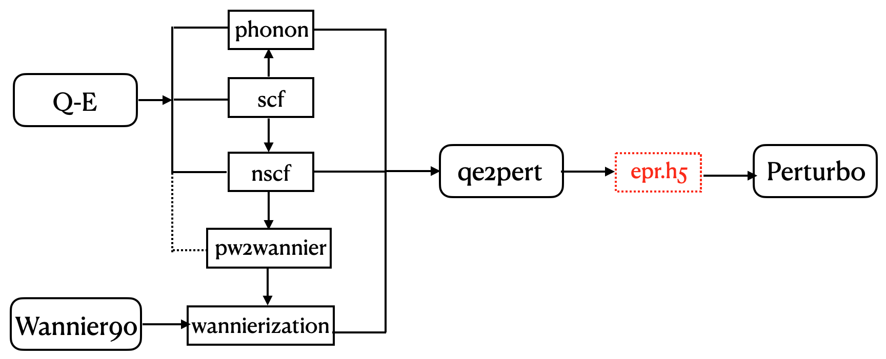
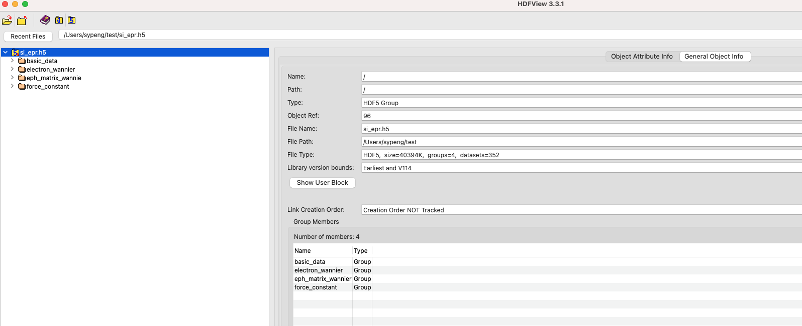
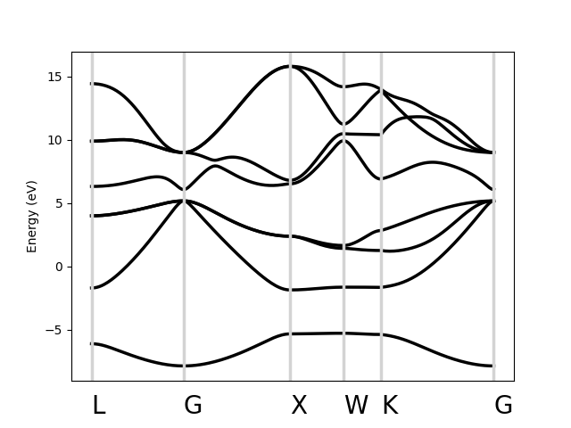
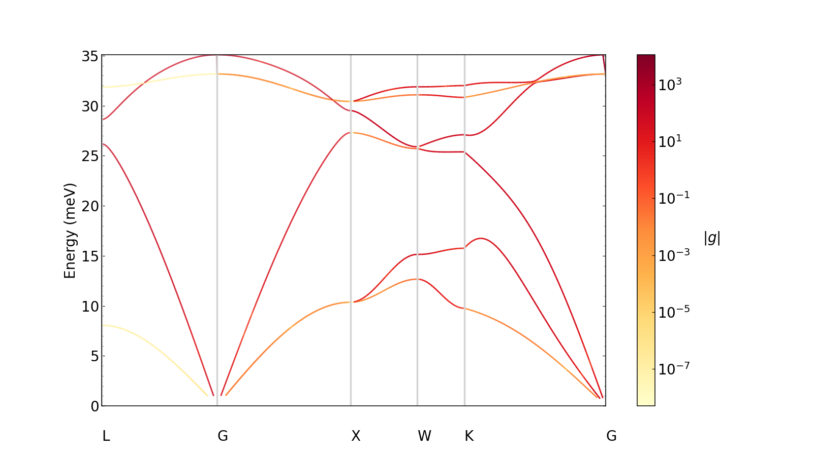
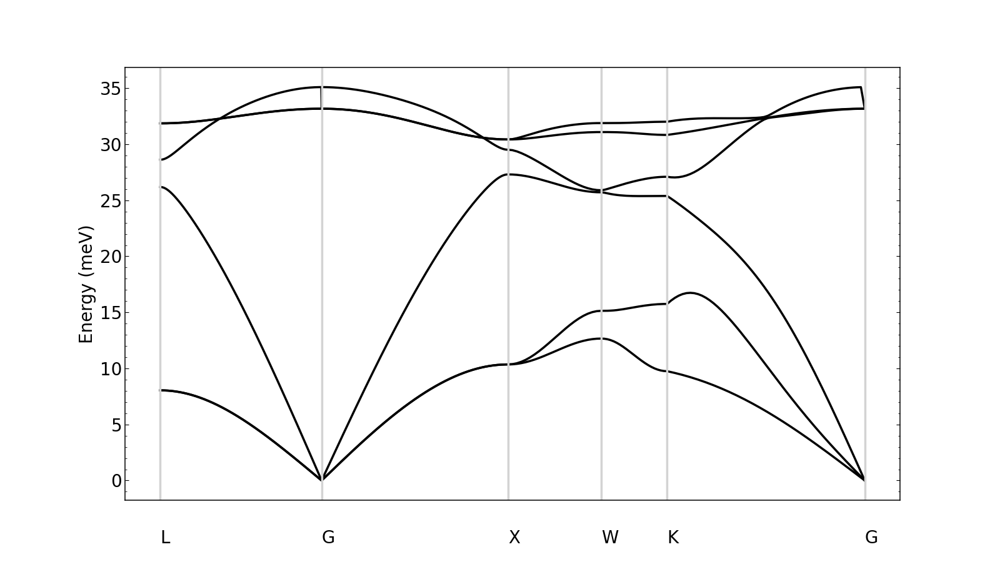

# Hands-on 2- Generating epr.h5

[TOC]


## Introduction
This handout mainly aims at showing how to generate epr.h5 file (**in the most recent released Perturbo version, the name of ~~epwan.h5~~ has been changed to epr.h5**), which is the most important input file for various following Perturbo calculations in hands-on 3&4. We take gallium arsenide (GaAs) with a coarse grid of (**k**, **q**) for an example. From the flowchart below, you can see the data flow,



## Task 1 --- generate epr.h5 

### tips before calculation

#### Download the workshop materials
```bash
cd ~
mkdir work
cd work
git clone git@github.com:perturbo-code/perturbo-workshop-2023.git
```

#### docker
To avoid wasting too much time in the installation of various softwares and dependent libraries in laptop due to unexpected technical problems, we adopt docker for the hands-on this time.
* ls current image
```bash=
docker image ls
```
* pull perturbo image
```bash=
docker pull perturbo/perturbo:gcc_openmp
```
* based on the image, creat a container

```bash=
docker run -v /Users/sypeng/work/docker_run/perturbo-workshop-2023:/home/user/run/perturbo-workshop-2023 -it --rm -h perturbocker --name perturbo2023 perturbo/perturbo:gcc_openmp
```
For the meaning of the parameters, please refer to [Perturbo website](https://perturbo-code.github.io/mydoc_docker.html). Here, we just emphasis that **-v**, which binds local directory of `/Users/sypeng/work/docker_run/perturbo-workshop-2023` and docker os folder `/home/user/run/perturbo-workshop-2023`, which means you can put the data which you will used in docker in the local foder of `/Users/sypeng/work/docker_run/perturbo-workshop-2023`, and then you can visit the data at docker folder of `/home/user/run/perturbo-workshop-2023`


* install perturbopy
```bash=
pip3 install perturbopy
```

#### folder hierarchy
- :open_file_folder: gallium_arsenide
    - :open_file_folder: **pw-ph-wan**
      - :file_folder: scf: self-consistent calculations using QE
      - :file_folder: nscf: non-self-consistent calculations using QE
      - :file_folder: phonon: deformation potential computed using QE
      - :file_folder: wann: maximally localized Wannier functions obtained using W90
    - :file_folder: **qe2pert**: electron-phonon matrix elements in Wannier basis
    - :open_file_folder: **perturbo**
      - :file_folder: pert-band: interpolated band structures using Perturbo
      - :file_folder: pert-trans: transport calculations using Perturbo
      - :file_folder: pert-ephmat: e-ph matrix using Perturbo


### scf
First of all, we need to perform the self-consistent calculation of electron density charge, which is the basis of all other calculations.

* executable: `pw.x`
* input file: `scf.in`
* execute command 
```bash=
>> cd workshop_perturbo_2023
>> cd Hands-on2
>> cd gallium_arsenide
>> cd pw_ph_wan
>> cd scf
>> export OMP_NUM_THREADS=6 # customize it with your PC
>> pw.x -i scf.in | tee scf.out
```
* job check: "JOB DONE" in the end of `scf.out`
* output: the charge density and wavefunction of the ground state is stored in `./tmp/gaas.save` by hdf5 format if you compiled Q-E with hdf5.

```
#scf.in
&control
   calculation='scf',
   prefix='gaas'
   pseudo_dir = '../pseudo'
   outdir='./tmp'
   tstress = .true.
/
&system
   ibrav=  2,
   celldm(1) =  10.50
   nat=  2,
   ntyp= 2,
   ecutwfc = 72.0,
/
&electrons
   mixing_beta     = 0.7
   conv_thr        = 1.0d-12
   diagonalization = 'david'
   diago_full_acc  = .true.
/
ATOMIC_SPECIES
 Ga  69.72   Ga.pz-hgh.UPF
 As  74.922  As.pz-hgh.UPF
ATOMIC_POSITIONS
 Ga 0.00000000 0.00000000 0.00000000
 As 0.25000000 0.25000000 0.25000000
K_POINTS {automatic}
 8 8 8 0 0 0
```


### phonon
Based on the convergent charge density, we can perform phonon and nscf calculations. The phonon calculation is based on the linear reponse perturbation theory (harmonic phonons).

* executable: `ph.x`
* input file: `ph.in`, `scf/tmp`
* execute command 
```bash=
>> cd phonon
>> cp -r ../scf/tmp ./
>> ph.x -i ph.in | tee ph.out
>> ctrl+c
>> rm -rf tmp
>> tar -xvzf tmp.tar.gz
```
* job check: "JOB DONE" in the end of `ph.out`
* output: most information such as dynamical matrix, phonon perturbation potentials, is stored in `tmp/_ph0/`.
* one more operation: collect phonon data to `save` folder for qe2pert
```bash=
>> ./ph-collect-serial.sh
```
The input file is attached. For fast running, you can use q grid by 2*2*2 in personal laptop.
```
#ph.in
Phonons on a uniform grid
&inputph
  tr2_ph=1.0d-13
  prefix='gaas'
  ldisp=.true.
  epsil=.true.
  lqdir = .true.
  outdir='./tmp'
  fildyn  = 'gaas.dyn.xml'
  fildvscf = 'dvscf'
  nq1=2, nq2=2, nq3=2,
/
```

### nscf
For constructing good maximum localized wannier functions, it needs a ground state information on a whole K grid not reduced Brillouin zone. Besides, we also need this in qe2pert to produce e-ph matrix for a coarse grid.

* executable: `pw.x`
* input file: `nscf.in`, `scf/tmp`
* execute command 
```bash=
>> cd nscf
>> cp -r ../scf/tmp ./
>> pw.x -i nscf.in | tee nscf.out
```
* job check: "JOB DONE" in the end of `nscf.out`
* output: the charge density and wavefunction of the ground state is stored in `./tmp/gaas.save` by hdf5 format if you compiled Q-E with hdf5.

A truncated `nscf.in` is attached
```
#truncated nscf.in
&CONTROL
  calculation = 'nscf'
/
K_POINTS crystal 
64 
```

### MLWF
Maximum localized wannier function is constructed to represent e-ph matrix in real space, which is crucial for interpolating ultra-fine (**k**,**q**) grid using perturbo later.
* executable: `pw2wannier.x`, `wannier90.x`
* input file: `pw2wan.in`, `gaas.win`, `nscf/tmp/gaas.save`
* execute command 
```bash=
>> cd wannier
>> mkdir tmp
>> cd tmp
>> ln -sf ../../nscf/tmp/gaas.save  # just read it not write it, os a soft link is better
# generate a list of the require overlops
>> wannier90.x -pp gaas
>> pw2wannier90.x -i pw2wan.in | tee pw2wan.out
>> wannier90.x gaas
```
* job check: "JOB DONE" in the end of `pw2wan.out` for `pw2wannier90.x`; and "All done: wannier90 exiting" in `gaas.wout`
* output: `gaas_u.mat`, `gaas_u_dis.mat`, and `gaas_centres.xyz` for qe2pert

`pw2wan.in` and truncated `gaas.win` is attached
```
#pw2wan.in 
&inputpp
 outdir='./tmp/'
  prefix = 'gaas'
  seedname = 'gaas'
  spin_component = 'none'
  write_mmn = .true.
  write_amn = .true.
  write_unk = .false.
/
```

```
#gaas.win
begin projections
 Ga:sp3
 As:sp3
end projections
guiding_centres=true

num_bands = 24
num_wann = 8

iprint = 2
dis_num_iter =  50
dis_win_min =  -1000.000
dis_win_max =   25.000
dis_froz_min = -1000.000
dis_froz_max  = 10.000
num_iter  =   100
mp_grid : 4 4 4

begin unit_cell_cart
bohr
-5.2500  0.0000  5.2500
 0.0000  5.2500  5.2500
-5.2500  5.2500  0.0000
end unit_cell_cart

write_u_matrices = .true.
write_xyz = .true.

BANDS_PLOT = TRUE
BANDS_PLOT_FORMAT = gnuplot
BANDS_NUM_POINTS = 100
BEGIN KPOINT_PATH
L 0.500 0.500 0.500  G 0.000 0.000 0.000
G 0.000 0.000 0.000  X 0.500 0.000 0.500
X 0.500 0.000 0.500  W 0.500 0.250 0.750
W 0.500 0.250 0.750  K 0.375 0.375 0.750
K 0.375 0.375 0.750  G 0.000 0.000 0.000
END KPOINT_PATH

begin atoms_frac
 Ga    0.00000   0.00000   0.00000
 As   -0.25000   0.75000  -0.25000
end atoms_frac

begin kpoints
 ...
end kpoints
```

### qe2pert
After finishing nscf, phonon and mlwf, we can perform qe2pert to integrate them to produce `{prefix}_epr.h5` which will be input to `perturbo.x`.

* executable: `qe2pert.in`
* input file: `qe2pert.in`, `phonon/save`, `nscf/tmp/gaas.save`, `gaas_centres.xyz`, `gaas_u_dis.mat`, `gaas_u.mat`
* execute command 
```bash=
>> cd qe2pert
>> mkdir tmp
>> cd tmp
>> ln -sf ../../pw-ph-wann/nscf/tmp/gaas.save
>> cd ../
>> ln -sf ../pw-ph-wann/wann/gaas_u.mat
>> ln -sf ../pw-ph-wann/wann/gaas_u_dis.mat
>> ln -sf ../pw-ph-wann/wann/gaas_centres.xyz
>>  qe2pert.x -i qe2pert.in | tee qe2pert.out
```
* job check: "Program was terminated on:" in `qe2pert.out`
* output: `gaas_epr.h5`

```
#qe2pert.in
qe2pert
&qe2pert
  prefix='gaas'
  outdir='./tmp'
  phdir='../pw-ph-wann/phonon/save'
  nk1=4, nk2=4, nk3=4
  dft_band_min = 1
  dft_band_max = 24
  num_wann = 8
  lwannier = .true.
/
```

**Now we finished the task 1 if you has already obtained `gaas_epr.h5`.**

## Task 2 --- access epr.h5

### HDFVIEW
> HDFView is a visual tool written in Java for browsing and editing HDF (HDF5 and HDF4) files. Using HDFView, you can:
> 
> View a file hierarchy in a tree structure
> Create new files, add or delete groups and datasets
> View and modify the content of a dataset
> Add, delete and modify attributes

[You can download here](https://www.hdfgroup.org/downloads/hdfview/), here I choose "HDFView-3.3.1-macos11_64.tar.gz" in "Pre-built Binary Distributions".
After successfully installing it, just open it and then drug the epr.h5 file to the left panel of HDF5VIEW. Then you can see somthing like below.

* general info.
    

* basic data.
    
Now you have an overall idea of the whole epr.h5 file.
For further processing with HDFVIEW, please refer to the [user guide](https://www.hdfgroup.org/downloads/hdfview/)


### h5ls
just type the follow command in the terminal 
```bash=
h5ls gaas_epr.h5
#or
h5ls demo_gaas_epr.h5/basic_data/zstar
```

### h5py
h5py provides rich functions to get access and manipulate hdf5 file, which consists of groups (something like folders) and datasets (something like numpy.array). 

* install
```bash=
>> conda install h5py
#or
>> pip install h5py
```

* import libraries
```python!
import h5py
import numpy as np
```

* read the epr.h5 file and access to the top sturcutre
```python!
f = h5py.File('gaas_epr.h5', 'r')
f_key = list(f.keys())
print('f_key_list=',f_key)
```

* get access to basic data, electron_wannier, eph_matrix_wannier, force_constant
```python=
#basic_data
print('\n\n',10*'-'+'basic_data'+10*'-')
basic_data = f['basic_data']
print('type of basic_data:',type(basic_data))

basic_data_key = list(basic_data.keys())
print('keys of basic_data:', basic_data_key)

print('basic_data.alat',np.array(basic_data[basic_data_key[0]]))

for ikey in basic_data_key:
    print(str(ikey),np.array(basic_data[ikey]))


#electron_wannier
print('\n\n',10*'-'+'electron_wannier'+10*'-')
electron_wannier = f['electron_wannier']
print('type of electron_wannier:',type(electron_wannier))

electron_wannier_key = list(electron_wannier.keys())
print('keys of electron_wannier :', electron_wannier_key)

for ikey in electron_wannier_key:
    print('electron_wannier.shape',np.array(electron_wannier[ikey]).shape)


#eph_matrix_wannier
print('\n\n',10*'-'+'eph_matrix_wannier'+10*'-')
eph_matrix_wannier = f['eph_matrix_wannier']
print('type of eph_matrix_wannier:',type(eph_matrix_wannier))

eph_matrix_wannier_key = list(eph_matrix_wannier.keys())
print('keys of eph_matrix_wannier :', eph_matrix_wannier_key)

for ikey in eph_matrix_wannier_key:
    print('eph_matrix_wannier.shape',np.array(eph_matrix_wannier[ikey]).shape)


#force_constant
print('\n\n',10*'-'+'force_constant'+10*'-')
force_constant = f['force_constant']
print('type of force_constant:',type(force_constant))

force_constant_key = list(force_constant.keys())
print('keys of force_constant :', force_constant_key)

for ikey in force_constant_key:
    print('force_constant.shape',np.array(force_constant[ikey]).shape)


f.close()
```


## Task 3 --- perturbo
Here we will use `perturbo.x` to performs electronic structure interpolation and phonon dispersion calculation as well as the e-ph coupling matrix. Other advanced functionalities will be shown in hands-on 3&4.

### electronic structure interpolation

* executable: `perturbo.x`
* input file: `pert.in`, `gaas_epr.h5`, `gaas_band.kpt`
* execute command 
```bash=
>> cd pert-bands
>> ln -sf ../../qe2pert/gaas_epr.h5
>> perturbo.x -i pert.in | tee pert.out
```
* job check: "Program was terminated on:" in `pert.out`
* output: `gaas.bands`, `gaas_bands.yml`
* the `pert.in` is attached
```
&perturbo
 prefix = 'gaas'
 calc_mode = 'bands'
 fklist = 'gaas_band.kpt'
/
```

* visualize the band (using perturbopy)
```bash=
>> python3 plot_band.py
```

```python=
import perturbopy.postproc as ppy
import matplotlib.pyplot as plt

fig, ax  = plt.subplots()
plt.rcParams.update(ppy.plot_tools.plotparams)

gaas_bands = ppy.Bands.from_yaml('gaas_bands.yml')
gaas_bands.kpt.add_labels(ppy.lattice.points_fcc)

gaas_bands.plot_bands(ax)
#plt.show()
plt.savefig('gaas_band.png')
```
open it with preview or open the finder (Mac):
```bash
>> open gaas_band.png 
#or 
>> open -a Finder .
```



### phonon dispersion

* executable: `perturbo.x`
* input file: `pert.in`, `gaas_epr.h5`, `gaas_phdisp.qpt`
* execute command 
```bash=
>> cd pert-phdisp
>> ln -sf ../../qe2pert/gaas_epr.h5
>> perturbo.x -i pert.in | tee pert.out
```
* job check: "Program was terminated on:" in `pert.out`
* output: `gaas.phdisp`, `gaas_phdisp.yml`
* The `pert.in` is attached
```
&perturbo
 prefix = 'gaas'
 calc_mode = 'phdisp'
 fqlist = 'gaas_phdisp.qpt'
/
```

* visualize the dispersion (using perturbopy)
```bash=
>> python3 plot_phdisp.py
```
```python=
import perturbopy.postproc as ppy
import matplotlib.pyplot as plt

gaas_phdisp = ppy.Phdisp.from_yaml('gaas_phdisp.yml')

# Create a figure and axis for plotting
fig, ax  = plt.subplots()

# Optional, used to format the plot
plt.rcParams.update(ppy.plot_tools.plotparams)

# Optional, used to label the q-points with labels for the FCC crystal structure.
# For example, [0.5, 0.5, 0.5] is the 'L' point in the FCC Brillouin zone.
gaas_phdisp.qpt.add_labels(ppy.lattice.points_fcc)

gaas_phdisp.plot_phdisp(ax)
#plt.show()
plt.savefig('gaas'_phdisp.png')
```
open it with preview or open the finder (Mac):
```bash
>> open gaas_phdisp.png 
#or 
>> open -a Finder .
```


### e-ph matrix 
* executable: `perturbo.x`
* input file: `pert.in`, `eph.kpt`, `eph.qpt`, `gaas_epr.h5`
* execute command 
```bash=
>> cd pert-ephmat
>> perturbo.x -i pert.in | tee pert.out
```
* job check: "Program was terminated on:" in `pert.out`
* output: `gaas.ephmat`, `gaas_ephmat.yml` 
* the `pert.in` is attached
```
&perturbo
 prefix = 'gaas'
 calc_mode = 'ephmat'
 fklist = 'gaas_band.kpt'
 fqlist = 'gaas_band.qpt'

 band_min = 5
 band_max = 5
/
```

* visualize the e-ph matrix elements at the k-point [0, 0, 0] (using perturbopy)
```bash=
>> python3 plot_ephmat.py
```
```python=
import perturbopy.postproc as ppy
import matplotlib.pyplot as plt

gaas_ephmat = ppy.Ephmat.from_yaml('gaas_ephmat.yml')

plt.rcParams.update(ppy.plot_tools.plotparams)
gaas_ephmat.qpt.add_labels(ppy.lattice.points_fcc)

fig, ax  = plt.subplots()
gaas_ephmat.plot_ephmat(ax,log=True)
#plt.show()
plt.savefig('gaas_ephmat.png')
```
open it with preview or open the finder (Mac):
```bash
>> open gaas_ephmat.png 
#or 
>> open -a Finder .
```



* visualize the phonon dispersion  (using perturbopy)

```python=
import perturbopy.postproc as ppy
import matplotlib.pyplot as plt

gaas_ephmat = ppy.Ephmat.from_yaml('gaas_ephmat.yml')
plt.rcParams.update(ppy.plot_tools.plotparams)
gaas_ephmat.qpt.add_labels(ppy.lattice.points_fcc)

fig, ax  = plt.subplots()
gaas_ephmat.plot_phdisp(ax)
#plt.show()
plt.savefig('gaas_ephmat_phdisp.png')
```
open the finder or directly open it with preview (Mac):
```bash
>> open gaas_ephmat_phdisp.png
#or 
>> open -a Finder .
```



