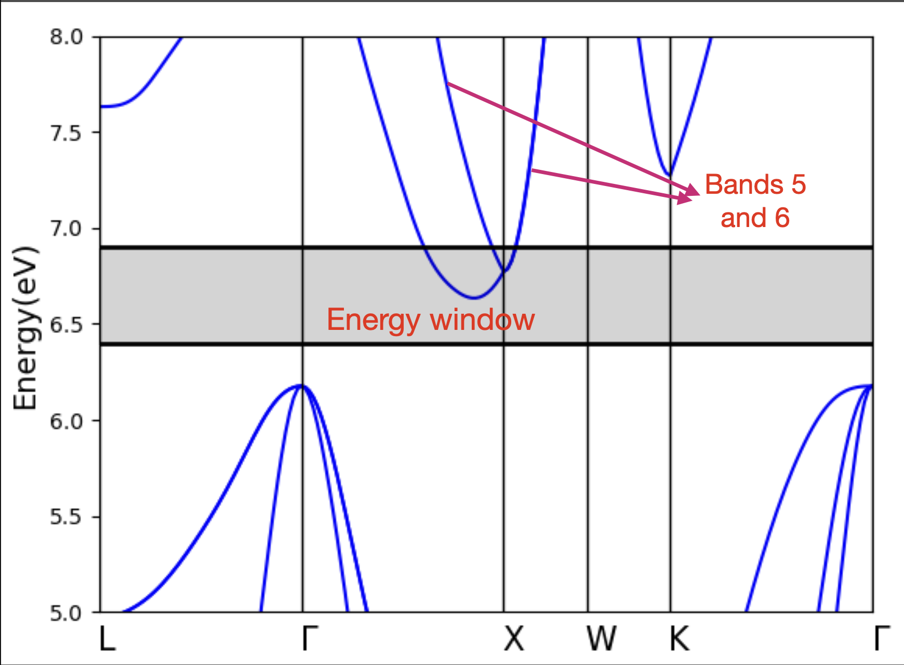
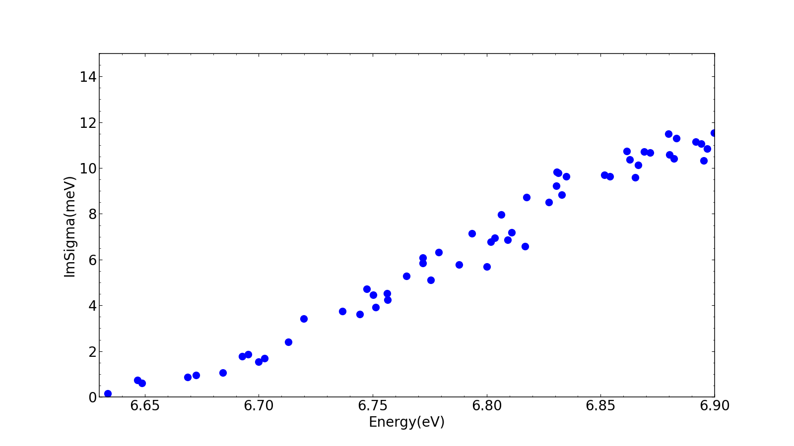
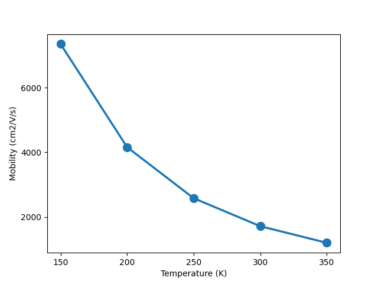
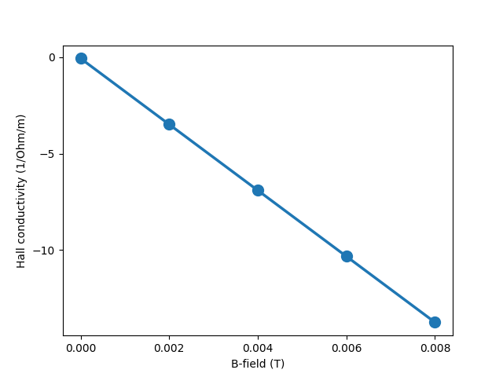

# Hands-on session 3  

## Introduction

This hands-on session covers electron-phonon scattering and transport calculations. We will be running calculation modes **setup**(grid setup), **imsigma** (scattering rates), **trans-rta** (RTA transport), **trans-mag-rta** (RTA magnetotransport), **trans-ita** (full BTE transport), and **trans-mag-ita** (full BTE magnetotransport) on silicon. 

Please download all the relevant files from this [github repository](https://github.com/perturbo-code/perturbo-workshop-2023/tree/main), and run docker on your local machine.  The References folder inside each of the directories contains outputs from previous runs. 

```
docker run -v <path-to_your_work_folder>:/home/user/run/<name_of_your_work_folder_in_container> --user 500 -it --rm --name perturbo perturbo/perturbo:<tag>
```

## calc_mode = 'setup'

You can find all the inputs inside the folder

``` bash
cd /home/user/run/perturbo-docker/silicon/perturbo/pert-setup-electron
```

The input file pert.in has several parameters
```
&perturbo
 prefix      = 'si'
 calc_mode   = 'setup'

 boltz_kdim(1) = 40   !kgrid along three crystal axes
 boltz_kdim(2) = 40
 boltz_kdim(3) = 40

 boltz_emin = 6.4  !Energy window
 boltz_emax = 6.9  !Energy window
 band_min = 5      !Band index 
 band_max = 6

 ftemper  = 'si.temper' !Name of .temper file
/
```
The parameters such as energy window (**boltz_emin** and **boltz_emax**) and band indices (**band_min** and **band_max**) can be better appreciated by looking at the bandstructure of silicon.



The si.temper file contains information about temperature, chemical potential, carrier concentration and magnetic field
```
1  F !T(K)      Ef(eV)     n(cm^-3)    Bx   By  Bz(Tesla)
     300.00 6.5504824219 0.9945847E+18 0.0 0.0 0.0
```

Create the soft link to the epr file **si_eph.h5**
``` bash
ln -sf /home/user/run/perturbo-docker/silicon/qe2pert/si_epr.h5
```
and run the calculation. 
``` bash
perturbo.x -i pert.in > pert.out
```

The setup calculation takes the information about the grid, energy window, temperature and fermi level, and outputs 4 files - **si_tet.h5**, **si_tet.kpt**, **si.doping**, **si.dos** and **si_setup.yml**. 
- The first two files **si_tet.h5** and **si_tet.kpt** contain information about the grid points (in HDF5 and text format) after application of energy window cutoff and symmetry operations.
- The file **si.doping** calculates carrier concentration from the Fermi level and vice-versa, depending on the flag (T/F) in the si.temper file. 
- The file **si.dos** contains the density of states as a function of carrier energies.
- The file **si_setup.yml** is a YAML file containing all the information in the setup outputs for easier postprocessing. 

## calc_mode = 'imsigma'

You can find all the inputs inside the folder

``` bash
cd /home/user/run/perturbo-docker/silicon/perturbo/pert-imsigma-electron
```

This calculation computes the imaginary part of the self-energy, from which information about the scattering rates can be extracted easily using the relation $\Gamma_{n\mathbf{k}}$ = $\frac{2}{\hbar}\mathrm{Im}\Sigma_{n\mathbf{k}}$. 

Here is the input file pert.in

```
&perturbo
  prefix      = 'si'
  calc_mode   = 'imsigma'

  fklist   = 'si_tet.kpt'  !kpt file from setup calculation
  ftemper  = 'si.temper'

  band_min = 5
  band_max = 6

  phfreq_cutoff = 0.625 ! meV !Phonon frequency cutoff
  delta_smear = 10 ! meV      !Smearing value

  sampling = 'uniform'  !Type of q-point sampling
  nsamples = 64000      !Number of q-points
 /
```

Copy the input files **si.temper** and **si_tet.kpt** from the setup calculation. The phonon q points are arbitrarily generated using the type of distribution (in this case **'uniform'**). 

Create a soft link to the **si_epr.h5** (as explained in the setup calculation), and run the calculation

``` bash
ln -sf /home/user/run/perturbo-docker/silicon/qe2pert/si_epr.h5
export OMP_NUM_THREADS=8
perturbo.x -i pert.in > pert.out
```

**Note**: While PERTURBO supports both MPI and OpenMP parallelization, we are running a serial, multi-threaded version, and since you will be running your calculation on your local machine, it's best to set OpenMP threads to the maximum number of cores in your machine. 

The calculation outputs 3 files - **si.imsigma**, **si.imsigma_mode** and **si_imsigma.yml**
- **si.imsigma** contains $\mathrm{Im}\Sigma$ in meV as a function of carrier energies.
- **si.imsigma_mode** contains mode resolved values of $\mathrm{Im}\Sigma$ in meV as a function of carrier energies.
- **si_imsigma.yml** contains information about **si_imsigma.yml** in a YAML format for easier postprocessing.

Use the plotting script **plot.py** to plot the values of $\mathrm{Im}\Sigma$ vs energy.



Note that this is not a completely converged calculation, as we have scaled down the parameters to reduce the computational cost. 


## calc_mode = 'trans-rta' or 'trans'

You can find all the inputs inside the folder

``` bash
cd /home/user/run/perturbo-docker/silicon/perturbo/pert-trans-RTA-electron
```

This calculation computes the transport coefficients such as conductivities, mobilities and seebeck coefficient for a given configuration specified in the **si.temper** file in the relaxation time approximation (RTA). This calculation is performed at zero magnetic field.

To do the RTA-transport calculation, copy the **si_tet.h5** file from the setup calculation. The **si.imsigma** and **si.temper** files are already provided as inputs in the folder. Note that the **si.temper** and **si.imsigma** files are different from the previous calculation as now we would like to compute transport at different temperatures. 

Here is the modified **si.temper** file
```
5  F !T(K)      Ef(eV)     n(cm^-3)    Bx   By  Bz(Tesla)
     150.00 6.5504824219 0.9945847E+18 0.0 0.0 0.0
     200.00 6.5504824219 0.9945847E+18 0.0 0.0 0.0
     250.00 6.5504824219 0.9945847E+18 0.0 0.0 0.0
     300.00 6.5504824219 0.9945847E+18 0.0 0.0 0.0
     350.00 6.5504824219 0.9945847E+18 0.0 0.0 0.0
```


<span style="color:red"> Note:</span> The file **si.imsigma** is not mandatory for any transport calculation. If it exists, the transport calculation will read the scattering rates from the imsigma file. If it is not provided, the scattering rates will be computed on the fly. 


The input file pert.in
```
&perturbo
 prefix      = 'si'
 calc_mode   = 'trans-rta' !'trans' is same as 'trans-rta'

 boltz_kdim(1) = 40   !Grid size
 boltz_kdim(2) = 40
 boltz_kdim(3) = 40

 boltz_emin = 6.4
 boltz_emax = 6.9
 band_min = 5
 band_max = 6

 ftemper  = 'si.temper'

 boltz_nstep = 0  ! RTA  !Number of steps for iterative approach
/
```

We are ready to run the RTA transport calculation:
```bash
ln -sf /home/user/run/perturbo-docker/silicon/qe2pert/si_epr.h5
export OMP_NUM_THREADS=8
perturbo.x -i pert.in > pert.out
```

The calculation outputs 5 files - **si.cond**, **si.trans_coef**,**si.tdf**, **si_tdf.h5** and **si_trans-rta.yml**.
- **si.cond** contains the values of conductivity and mobility tensor
- **si.trans_coef** contains the values of conductivity, mobility and seebeck tensors
- **si.tdf** and **si_tdf.h5** contains transport distribution function (TDF) as a function of carrier energies. 
- **si_trans-rta.yml**  contains all the information about this transport calculation for easy postprocessing.

## calc_mode = 'trans-mag-rta'

``` bash
cd /home/user/run/perturbo-docker/silicon/perturbo/pert-trans-mag-RTA-electron
```

This calculation is very similar to the calc_mode 'trans_rta', except for finite magnetic fields. 
```
&perturbo
 prefix      = 'si'
 calc_mode   = 'trans-mag-rta'

 boltz_kdim(1) = 40
 boltz_kdim(2) = 40
 boltz_kdim(3) = 40

 boltz_emin = 6.4
 boltz_emax = 6.9
 band_min = 5
 band_max = 6

 ftemper  = 'si.temper'

 boltz_nstep = 20  ! magnetic-RTA still requires iterations
/
```

Note that we are doing different magnetic fields at the same temperature, as opposed to ``calc_mode='trans-rta'``, where we calculated transport coefficients for 5 different temperatures at zero fields. Therefore, the files **si.temper** and **si.imsigma** are different from the ``calc_mode='trans-rta'``. For now, feel free to use the input files provided in the folder.

We specify the magnetic fields inside the file **si.temper**
```
5  F !T(K)      Ef(eV)     n(cm^-3)    Bx   By  Bz(Tesla)
  300.00          6.5504824219           0.9945847E+18   0.0   0.0  0.0
  300.00          6.5504824219           0.9945847E+18   0.0   0.0  0.002
  300.00          6.5504824219           0.9945847E+18   0.0   0.0  0.004
  300.00          6.5504824219           0.9945847E+18   0.0   0.0  0.006
  300.00          6.5504824219           0.9945847E+18   0.0   0.0  0.008
```


Now, run the calculation
```bash
ln -sf /home/user/run/perturbo-docker/silicon/qe2pert/si_epr.h5
export OMP_NUM_THREADS=8
perturbo.x -i pert.in > pert.out
```

The output files generated are same as in the above calculation, except for different magnetic fields - **si.cond**, **si.trans_coef**,**si.tdf**, **si_tdf.h5** and **si_trans-mag-rta.yml**.


## calc_mode = 'trans-ita'

You can find all the inputs inside the folder

``` bash
cd /home/user/run/perturbo-docker/silicon/perturbo/pert-trans-ITA-electron
```

This calculation computes the transport coefficients using the full Boltzmann Transport Equation using the iterative approach. 

The **si_tet.h5** and **si.temper** (same as ``calc_mode='trans-rta'``) files are already provided in the input folder.


As mentioned earlier, the file **si.imsigma** is not necessary for any transport calculation, so we will not be using that here. 


The input file pert.in
```
&perturbo
 prefix      = 'si'
 calc_mode   = 'trans-ita'

 boltz_kdim(1) = 40
 boltz_kdim(2) = 40
 boltz_kdim(3) = 40

 !load_scatter_eph = .true.
 boltz_emin = 6.4
 boltz_emax = 6.9
 band_min = 5
 band_max = 6

 ftemper  = 'si.temper'

 tmp_dir = './tmp'

 boltz_nstep = 10  !max number of iterations
 phfreq_cutoff = 1  !meV
 delta_smear = 10       !meV
/
```

<span style="color:red"> Note:</span> The flag ``load_scatter_eph`` is set commented out in this calculation. It reads the electron-phonon matrix elements from the stored hdf5 file  **tmp/si_eph_g2_p1.h5** that was generated using a previous transport run, so as to reuse the same matrix elements without having to compute them again. 

If your computer is slow, please feel free to download the pre-existing tmp file, and uncomment this flag. 


We are ready to run the ITA transport calculation:
```bash
ln -sf /home/user/run/perturbo-docker/silicon/qe2pert/si_epr.h5
export OMP_NUM_THREADS=8
perturbo.x -i pert.in > pert.out
```

The calculation outputs 5 files - **si.cond**, **si.trans_coef**,**si.tdf**, **si_tdf.h5** and **si_trans-ita.yml**. These files contain the same information as any other transport calculation, except **si.cond** file also prints out the conductivity tensor at each step in the iterative process.
```

          #==========================================================#
          #                  Conductivity (1/Ohm/m)                  #
          #----------------------------------------------------------#

#  T (K)   E_f(eV)   n_c (cm^-3)      sigma_xx       sigma_xy       sigma_yy       sigma_xz       sigma_yz       sigma_zz
  300.00   6.55048   0.72293E+18    0.198582E+05  -0.586098E-01   0.198585E+05  -0.485724E+00   0.308200E+00   0.198585E+05
          #--------------------iterative process---------------------#
  #iter.       sigma_xx       sigma_xy       sigma_yy       sigma_xz       sigma_yz       sigma_zz
  #   1      0.194550E+05  -0.309652E+00   0.194553E+05  -0.316228E+00   0.654849E-01   0.194550E+05
  #   2      0.197008E+05  -0.233345E+00   0.197009E+05  -0.453954E+00   0.360551E+00   0.197012E+05
  #   3      0.199131E+05  -0.121030E+00   0.199134E+05  -0.484218E+00   0.308276E+00   0.199134E+05
  #   4      0.198372E+05  -0.101467E+00   0.198375E+05  -0.484292E+00   0.310662E+00   0.198375E+05
  #   5      0.198845E+05  -0.690693E-01   0.198848E+05  -0.486115E+00   0.308315E+00   0.198848E+05
  #   6      0.198582E+05  -0.586098E-01   0.198585E+05  -0.485724E+00   0.308200E+00   0.198585E+05
          #----------------------------------------------------------#
          
          
          #==========================================================#
          #                    Mobility (cm^2/V/s)                   #
          #--------------------(for semiconductor)-------------------#

#  T (K)   E_f(eV)   n_c (cm^-3)       mu_xx          mu_xy          mu_yy          mu_xz          mu_yz          mu_zz
  300.00   6.55048   0.72293E+18    0.171448E+04  -0.506015E-02   0.171451E+04  -0.419356E-01   0.266088E-01   0.171451E+04
```

Use the plotting script plot.py to plot the mobility as a function of temperature.




## calc_mode = 'trans-mag-ita'

This calculation is similar to the calc_mode 'trans-ita', except calculations are performed at a finite magnetic field.

```
&perturbo
 prefix      = 'si'
 calc_mode   = 'trans-mag-ita'

 boltz_kdim(1) = 40
 boltz_kdim(2) = 40
 boltz_kdim(3) = 40

 !load_scatter_eph = .true.
 boltz_emin = 6.4
 boltz_emax = 6.9
 band_min = 5
 band_max = 6

 ftemper  = 'si.temper'

 tmp_dir = './tmp'

 boltz_nstep = 10  !max number of iterations
 phfreq_cutoff = 1  !meV
 delta_smear = 10       !meV
/

```
The **si_tet.h5** and **si.temper** (same as ``calc_mode='trans-mag-rta'``) files are already provided in the input folder.


```bash
ln -sf /home/user/run/perturbo-docker/silicon/qe2pert/si_epr.h5
export OMP_NUM_THREADS=8
perturbo.x -i pert.in > pert.out
```


The output files generated are same as in the above calculation (calc_mode 'trans-ita'), except for different magnetic fields - **si.cond**, **si.trans_coef**,**si.tdf**, **si_tdf.h5** and **si_trans-mag-ita.yml**.

We can plot the Hall conductivity as a function of magnetic field using the script plot.py




<span style="color:red"> Note:</span> This calculation is not completely converged as we downscaled the grid size to make the calculation affordable.
