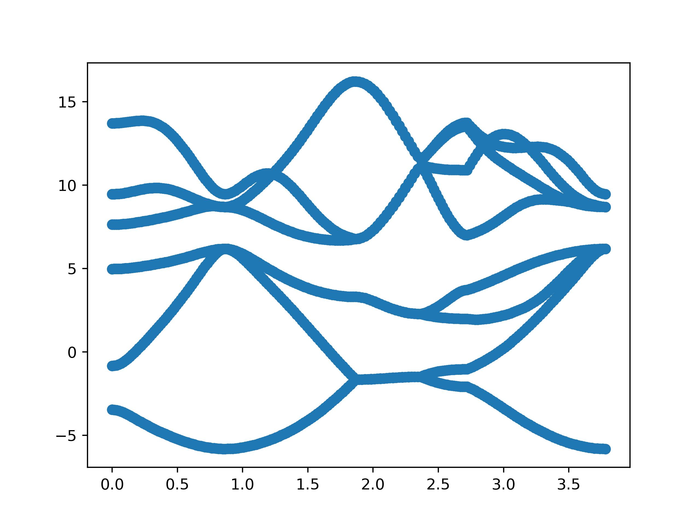
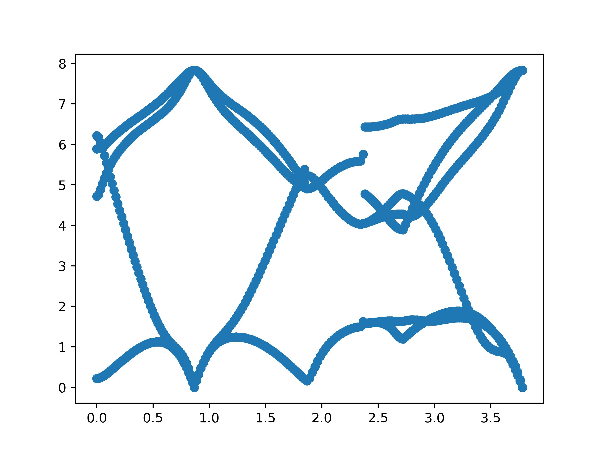

#Generation of epr file 
This tutorial shows how to generate epr file, the core database of perturbo. We use Silicon with a very coarse grid as a minimal example. 

## 0. docker setup
For gcc version
```
docker run -v /Users/yaoluo/workshop:/run/epr_gen --user 500 -it --rm --name 
perturbo perturbo/perturbo:gcc
pip3 install numpy 
pip3 install matplotlib.pyplot as plt 
```
## 1. DFT & DFPT 
Download the tutorial file, go to the directory.  
```
cd silicon
user@f34442ffeba6:/run/epr_gen/silicon$ cd ..
user@f34442ffeba6:/run/epr_gen$ ls
silicon  silicon.zip
user@f34442ffeba6:/run/epr_gen$ cd silicon
user@f34442ffeba6:/run/epr_gen/silicon$ ls
nscf  perturbo  phonon  pseudo  pw  qe2pert  wannier
```
### 1.1. SCF
The input file of SCF calculation.
```
user@f34442ffeba6:/run/epr_gen/silicon/pw$ cat scf.in
&CONTROL
  prefix = 'si'
  calculation = 'scf'
  wf_collect = .true.
  outdir='./tmp'
  pseudo_dir='../pseudo'
/
&SYSTEM
  ibrav = 2
  celldm(1) = 10.264
  nat = 2
  ntyp = 1
  ecutwfc = 60.0 ! 40.0 => phonon will fail...
  !noncolin = .true.
  !lspinorb = .true.
/
&ELECTRONS
  conv_thr = 1.0d-15
  mixing_mode = 'plain'
  mixing_beta = 0.7
  diagonalization = 'david'
  diago_full_acc = .true.
/
&IONS
/
&CELL
press_conv_thr = 0.01
/
ATOMIC_SPECIES
  Si   28.085  Si_DOJO_PBEsol.upf
ATOMIC_POSITIONS crystal
Si  0.00000000  0.00000000  0.00000000
Si -0.25000000  0.75000000 -0.25000000
K_POINTS (automatic)
 8 8 8 0 0 0
```

Run SCF calculation to get the groundstate charge density. 
```
user@f34442ffeba6:/run/epr_gen/silicon/pw$ pw.x -i scf.in > scf.out 
```
### 1.2. NSCF & Wannier90 
Run NSCF to get the electron wavefunction on a 4x4x4 k grid. 
The input file is below. 
`nbnd` specifies how many bands/eigenstate are calculated. We want to include the conduction bands, so we set a number larger than 8.  
```
user@f34442ffeba6:/run/epr_gen/silicon/nscf$ cat nscf.in
&CONTROL
  prefix = 'si'
  calculation = 'nscf'
  wf_collect = .true.
  outdir='./tmp'
  pseudo_dir='../pseudo'
/
&SYSTEM
  ibrav = 2
  celldm(1) = 10.264
  nat = 2
  nbnd = 16
  ntyp = 1
  ecutwfc = 60.0
  !noncolin = .true.
  !lspinorb = .true.
/
&ELECTRONS
  conv_thr = 5.0d-13
  mixing_mode = 'plain'
  mixing_beta = 0.7
  diagonalization = 'david'
  diago_full_acc = .true.
/
&IONS
/
&CELL
press_conv_thr = 0.01
/
ATOMIC_SPECIES
  Si   28.085  Si_DOJO_PBEsol.upf
ATOMIC_POSITIONS crystal
Si  0.00000000  0.00000000  0.00000000
Si -0.25000000  0.75000000 -0.25000000
K_POINTS crystal
64
  0.00000000  0.00000000  0.00000000  1.562500e-02
  0.00000000  0.00000000  0.25000000  1.562500e-02
  0.00000000  0.00000000  0.50000000  1.562500e-02
  0.00000000  0.00000000  0.75000000  1.562500e-02
  0.00000000  0.25000000  0.00000000  1.562500e-02
  0.00000000  0.25000000  0.25000000  1.562500e-02
  0.00000000  0.25000000  0.50000000  1.562500e-02
  0.00000000  0.25000000  0.75000000  1.562500e-02
  0.00000000  0.50000000  0.00000000  1.562500e-02
  0.00000000  0.50000000  0.25000000  1.562500e-02
  0.00000000  0.50000000  0.50000000  1.562500e-02
  0.00000000  0.50000000  0.75000000  1.562500e-02
  0.00000000  0.75000000  0.00000000  1.562500e-02
  0.00000000  0.75000000  0.25000000  1.562500e-02
  0.00000000  0.75000000  0.50000000  1.562500e-02
  0.00000000  0.75000000  0.75000000  1.562500e-02
  0.25000000  0.00000000  0.00000000  1.562500e-02
  0.25000000  0.00000000  0.25000000  1.562500e-02
  0.25000000  0.00000000  0.50000000  1.562500e-02
  0.25000000  0.00000000  0.75000000  1.562500e-02
  0.25000000  0.25000000  0.00000000  1.562500e-02
  0.25000000  0.25000000  0.25000000  1.562500e-02
  0.25000000  0.25000000  0.50000000  1.562500e-02
  0.25000000  0.25000000  0.75000000  1.562500e-02
  0.25000000  0.50000000  0.00000000  1.562500e-02
  0.25000000  0.50000000  0.25000000  1.562500e-02
  0.25000000  0.50000000  0.50000000  1.562500e-02
  0.25000000  0.50000000  0.75000000  1.562500e-02
  0.25000000  0.75000000  0.00000000  1.562500e-02
  0.25000000  0.75000000  0.25000000  1.562500e-02
  0.25000000  0.75000000  0.50000000  1.562500e-02
  0.25000000  0.75000000  0.75000000  1.562500e-02
  0.50000000  0.00000000  0.00000000  1.562500e-02
  0.50000000  0.00000000  0.25000000  1.562500e-02
  0.50000000  0.00000000  0.50000000  1.562500e-02
  0.50000000  0.00000000  0.75000000  1.562500e-02
  0.50000000  0.25000000  0.00000000  1.562500e-02
  0.50000000  0.25000000  0.25000000  1.562500e-02
  0.50000000  0.25000000  0.50000000  1.562500e-02
  0.50000000  0.25000000  0.75000000  1.562500e-02
  0.50000000  0.50000000  0.00000000  1.562500e-02
  0.50000000  0.50000000  0.25000000  1.562500e-02
  0.50000000  0.50000000  0.50000000  1.562500e-02
  0.50000000  0.50000000  0.75000000  1.562500e-02
  0.50000000  0.75000000  0.00000000  1.562500e-02
  0.50000000  0.75000000  0.25000000  1.562500e-02
  0.50000000  0.75000000  0.50000000  1.562500e-02
  0.50000000  0.75000000  0.75000000  1.562500e-02
  0.75000000  0.00000000  0.00000000  1.562500e-02
  0.75000000  0.00000000  0.25000000  1.562500e-02
  0.75000000  0.00000000  0.50000000  1.562500e-02
  0.75000000  0.00000000  0.75000000  1.562500e-02
  0.75000000  0.25000000  0.00000000  1.562500e-02
  0.75000000  0.25000000  0.25000000  1.562500e-02
  0.75000000  0.25000000  0.50000000  1.562500e-02
  0.75000000  0.25000000  0.75000000  1.562500e-02
  0.75000000  0.50000000  0.00000000  1.562500e-02
  0.75000000  0.50000000  0.25000000  1.562500e-02
  0.75000000  0.50000000  0.50000000  1.562500e-02
  0.75000000  0.50000000  0.75000000  1.562500e-02
  0.75000000  0.75000000  0.00000000  1.562500e-02
  0.75000000  0.75000000  0.25000000  1.562500e-02
  0.75000000  0.75000000  0.50000000  1.562500e-02
  0.75000000  0.75000000  0.75000000  1.562500e-02
```
Copy the ground state charge density from the previous scf calculation.
```
user@f34442ffeba6:/run/epr_gen/silicon/nscf$ cp -rf ../pw/tmp .
```

```
user@f34442ffeba6:/run/epr_gen/silicon/nscf$ pw.x -i nscf.in > nscf.out
```
Construct wannier function using the wavefunction generated in the previous step.

The `wannier90.x` input file is si.win. Consistentcy on `num_bands` and `kpoints`. 
```
user@d163e83e57d2:/run/epr_gen/silicon/wannier$ cat si.win
begin projections
 Si:sp3
end projections

! perturbo needs this 
guiding_centres=true

!spinors = .true.

num_bands = 16
num_wann = 8


iprint = 2
dis_num_iter =  500
dis_win_min =  -100.000
dis_win_max =   17.200
dis_froz_min = -100.000
dis_froz_max  = 9.000
num_iter  =   5000
mp_grid : 4 4 4

begin unit_cell_cart
bohr
-5.1320  0.0000  5.1320
 0.0000  5.1320  5.1320
-5.1320  5.1320  0.0000
end unit_cell_cart

! perturbo needs this 
write_u_matrices = .true.
write_xyz = .true.


#restart = plot
BANDS_PLOT = TRUE
BANDS_PLOT_FORMAT = gnuplot
BANDS_NUM_POINTS = 100

BEGIN KPOINT_PATH
L 0.500 0.500 0.500  G 0.000 0.000 0.000
G 0.000 0.000 0.000  X 0.500 0.000 0.500
X 0.500 0.000 0.500  W 0.500 0.250 0.750
W 0.500 0.250 0.750  K 0.375 0.375 0.750
K 0.375 0.375 0.750  G 0.000 0.000 0.000
END KPOINT_PATH

begin atoms_frac
 Si    0.00000   0.00000   0.00000
 Si   -0.25000   0.75000  -0.25000
end atoms_frac


begin kpoints
0.00000000  0.00000000  0.00000000
  0.00000000  0.00000000  0.25000000
  0.00000000  0.00000000  0.50000000
  0.00000000  0.00000000  0.75000000
  0.00000000  0.25000000  0.00000000
  0.00000000  0.25000000  0.25000000
  0.00000000  0.25000000  0.50000000
  0.00000000  0.25000000  0.75000000
  0.00000000  0.50000000  0.00000000
  0.00000000  0.50000000  0.25000000
  0.00000000  0.50000000  0.50000000
  0.00000000  0.50000000  0.75000000
  0.00000000  0.75000000  0.00000000
  0.00000000  0.75000000  0.25000000
  0.00000000  0.75000000  0.50000000
  0.00000000  0.75000000  0.75000000
  0.25000000  0.00000000  0.00000000
  0.25000000  0.00000000  0.25000000
  0.25000000  0.00000000  0.50000000
  0.25000000  0.00000000  0.75000000
  0.25000000  0.25000000  0.00000000
  0.25000000  0.25000000  0.25000000
  0.25000000  0.25000000  0.50000000
  0.25000000  0.25000000  0.75000000
  0.25000000  0.50000000  0.00000000
  0.25000000  0.50000000  0.25000000
  0.25000000  0.50000000  0.50000000
  0.25000000  0.50000000  0.75000000
  0.25000000  0.75000000  0.00000000
  0.25000000  0.75000000  0.25000000
  0.25000000  0.75000000  0.50000000
  0.25000000  0.75000000  0.75000000
  0.50000000  0.00000000  0.00000000
  0.50000000  0.00000000  0.25000000
  0.50000000  0.00000000  0.50000000
  0.50000000  0.00000000  0.75000000
  0.50000000  0.25000000  0.00000000
  0.50000000  0.25000000  0.25000000
  0.50000000  0.25000000  0.50000000
  0.50000000  0.25000000  0.75000000
  0.50000000  0.50000000  0.00000000
  0.50000000  0.50000000  0.25000000
  0.50000000  0.50000000  0.50000000
  0.50000000  0.50000000  0.75000000
  0.50000000  0.75000000  0.00000000
  0.50000000  0.75000000  0.25000000
  0.50000000  0.75000000  0.50000000
  0.50000000  0.75000000  0.75000000
  0.75000000  0.00000000  0.00000000
  0.75000000  0.00000000  0.25000000
  0.75000000  0.00000000  0.50000000
  0.75000000  0.00000000  0.75000000
  0.75000000  0.25000000  0.00000000
  0.75000000  0.25000000  0.25000000
  0.75000000  0.25000000  0.50000000
  0.75000000  0.25000000  0.75000000
  0.75000000  0.50000000  0.00000000
  0.75000000  0.50000000  0.25000000
  0.75000000  0.50000000  0.50000000
  0.75000000  0.50000000  0.75000000
  0.75000000  0.75000000  0.00000000
  0.75000000  0.75000000  0.25000000
  0.75000000  0.75000000  0.50000000
  0.75000000  0.75000000  0.75000000
end kpoints
```

Link the wavefunction from NSCF calculation to the wannier90 working directory. 
```
user@f34442ffeba6:/run/epr_gen/silicon/wannier$ ln -sf ../nscf/tmp
```

```
user@d163e83e57d2:/run/epr_gen/silicon/wannier$ cat run-wan.sh
#!/bin/bash
#export OMP_NUM_THREADS=4
wannier90.x -pp si.win
pw2wannier90.x  < pw2wan.in > pw2wan.out
wannier90.x  si.win
user@f34442ffeba6:/run/epr_gen/silicon/wannier$ ./run-wan.sh 
```


### 1.3. DFPT 
Run DFPT to get dynamical matrix and e-ph matrix elements on coarse grid, 4x4x4 for k and 2x2x2 for q. 

Copy ground state charge density from the SCF calculation.
```
user@f34442ffeba6:/run/epr_gen/silicon/phonon$ cp -rf ../pw/tmp ./
```

```
user@d163e83e57d2:/run/epr_gen/silicon/phonon$ cat ph.in
Phonons on a uniform grid
&inputph
  verbosity='debug'
  tr2_ph=1.0d-13
  prefix='si'
  ldisp=.true.
  epsil=.true.
  lqdir=.true.
  outdir='./tmp'
  fildyn  = 'si.dyn.xml'
  fildvscf = 'dvscf'
  nq1=2, nq2=2, nq3=2,
/
user@f34442ffeba6:/run/epr_gen/silicon/phonon$ ph.x -i ph.in > ph.out 
```
This ph.x calculation takes 3 mins on my macbook. 

Then, collect the dynamical matrix and e-ph matrix elements on coarse grid and save them in `/save`.
```
user@d163e83e57d2:/run/epr_gen/silicon/phonon$ cat ph-collect.sh
#!/bin/bash
PREFIX='si'

#should be in the work directory of PHonon calculation
echo `pwd`
mkdir -p save
mkdir -p save/${PREFIX}.phsave

for ((NQ=2; NQ<=3; NQ++ ))
do
   DIR="tmp/_ph0"
   echo $DIR
   #copy prefix.phsave
   cp ${DIR}/${PREFIX}.phsave/* save/${PREFIX}.phsave/
   #copy dyn files
   #cp ph-${NQ}/${PREFIX}.dyn${NQ} save/  #${PREFIX}.dyn_q${NQ}
   cp ${PREFIX}.dyn* save/
   #copy dvscf files
   cp ${DIR}/${PREFIX}.q_${NQ}/${PREFIX}.dvscf save/${PREFIX}.dvscf_q${NQ}
done

NQ=1
cp ${DIR}/${PREFIX}.dvscf save/${PREFIX}.dvscf_q${NQ}
user@d163e83e57d2:/run/epr_gen/silicon/phonon$ ./ph-collect.sh
```

## 2. qe2pert 
Link files in the qe2pert working directory. 
```
user@f34442ffeba6:/run/epr_gen/silicon/qe2pert$ ln -sf ../wannier/si_u.mat
user@f34442ffeba6:/run/epr_gen/silicon/qe2pert$ ln -sf ../wannier/si_u_dis.mat
user@f34442ffeba6:/run/epr_gen/silicon/qe2pert$ ln -sf ../wannier/si_centres.xyz
user@f34442ffeba6:/run/epr_gen/silicon/qe2pert$ mkdir tmp
user@f34442ffeba6:/run/epr_gen/silicon/qe2pert/tmp$ ln -sf ../../nscf/tmp/si.save/
user@f34442ffeba6:/run/epr_gen/silicon/qe2pert/tmp$ ln -sf ../../nscf/tmp/si.xml
user@f34442ffeba6:/run/epr_gen/silicon/qe2pert/tmp$ cd ..
```

Open qe2pert.in file, get familiar with it. 
```
user@f34442ffeba6:/run/epr_gen/silicon/qe2pert$ cat qe2pert.in
&qe2pert
  prefix='si'
  outdir='./tmp'
  phdir='../phonon/save'
  nk1=4, nk2=4, nk3=4
  dft_band_min = 1
  dft_band_max = 16
  num_wann = 8
  lwannier=.true.
/
```
Pay attention to the consistency on all the parameters. 
`lwannier = .true.` means qe2pert will store the wavefunction in wannier gauge which greatly saves memory and may cause error if the previous wannierization step is very bad. 
```
user@f34442ffeba6:/run/epr_gen/silicon/qe2pert$ qe2pert.x -i qe2pert.in
```
Finally, we have the `si_epr.h5` file. 

## 3. perturbo 
With `si_epr.h5`, we can get electron's band struture, phonon's dispersion and e-ph matrix elements.

### Electron band structure
Let's see the input files. 
```
user@d163e83e57d2:/run/epr_gen/silicon/perturbo/band$ cat pert.in
&perturbo
 prefix = 'si'
 calc_mode = 'bands'
 fklist = 'si_band.kpt'
/
user@d163e83e57d2:/run/epr_gen/silicon/perturbo/band$ cat si_band.kpt
6
0.500 0.500 0.500  50
0.000 0.000 0.000  50
0.500 0.000 0.500  20
0.500 0.250 0.750  20
0.375 0.375 0.750  50
0.000 0.000 0.000  1
```

Link the `epr` file. 
```
user@f34442ffeba6:/run/epr_gen/silicon/perturbo/band$ ln -sf ../../qe2pert/si_epr.h5
```
```
perturbo.x -i pert.in 
```

```
user@de401a4c683a:/run/epr_gen/silicon/perturbo/band$ python plot.py
```
The bandstucture is shown in `band.jpg`. 



### Phonon dispersion
Let's take a look of the input files. 
```
user@d163e83e57d2:/run/epr_gen/silicon/perturbo/phonon$ cat pert.in
&perturbo
 prefix = 'si'
 calc_mode = 'phdisp'
 fqlist = 'si_band.kpt'
/
user@d163e83e57d2:/run/epr_gen/silicon/perturbo/phonon$ cat si_band.kpt
6
0.500 0.500 0.500  50
0.000 0.000 0.000  50
0.500 0.000 0.500  20
0.500 0.250 0.750  20
0.375 0.375 0.750  50
0.000 0.000 0.000  1
```

```
user@f34442ffeba6:/run/epr_gen/silicon/perturbo/phonon$ ln -sf ../../qe2pert/si_epr.h5
```

```
perturbo.x -i pert.in 
```

```
user@de401a4c683a:/run/epr_gen/silicon/perturbo/phonon$ python plot.py
```
The phonon dispersion is shown in `band.jpg`. 

### E-ph
Let's see the input files. 
```
user@d163e83e57d2:/run/epr_gen/silicon/perturbo/ephmat$ cat pert.in
&perturbo
 prefix = 'si'
 calc_mode = 'ephmat'
 fklist = 'si_band.kpt'
 fqlist = 'si_band.qpt'

 band_min = 2
 band_max = 4
/
user@d163e83e57d2:/run/epr_gen/silicon/perturbo/ephmat$ cat si_band.kpt
1
0.0 0.0 0.0 1
user@d163e83e57d2:/run/epr_gen/silicon/perturbo/ephmat$ cat si_band.qpt
6
0.500 0.500 0.500  50
0.000 0.000 0.000  50
0.500 0.000 0.500  20
0.500 0.250 0.750  20
0.375 0.375 0.750  50
0.000 0.000 0.000  1
```
Link the `epr` file. 
```
user@f34442ffeba6:/run/epr_gen/silicon/perturbo/ephmat$ ln -sf ../../qe2pert/si_epr.h5
```
Interpolate e-ph matrix. 
```
perturbo.x -i pert.in 
```
Plot. 
```
user@de401a4c683a:/run/epr_gen/silicon/perturbo/ephmat$ python plot.py
```
The e-ph coupling strength along high symmetry points is shown in `band.jpg`. 

