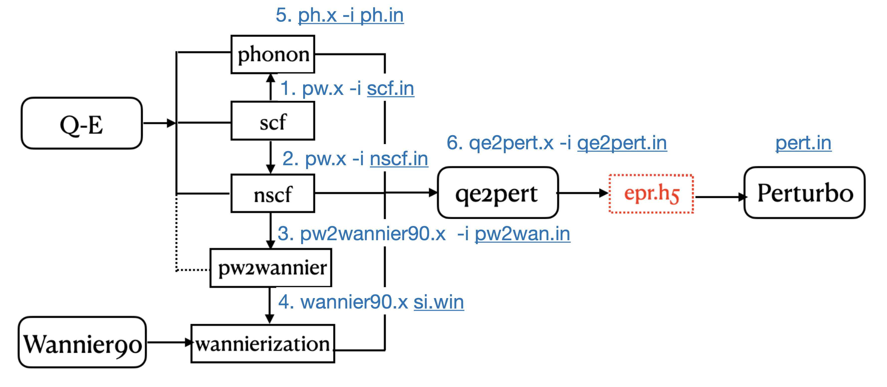

#Generation of epr file 
This tutorial shows how to generate epr file, the core database of perturbo. We use Silicon with a very coarse grid as a minimal example. 




Example : Silicon

## 0. docker setup
Check `https://perturbo-code.github.io/mydoc_docker.html` to setup docker of perturbo. 
For gcc version
```
docker run -v /Users/yaoluo/workshop:/run/epr_gen --user 500 -it --rm --name 
perturbo perturbo/perturbo:gcc_openmp
```
## 1. DFT & DFPT 
Download the tutorial file, go to the directory `silicon/`.  
```
user@f34442ffeba6:/run/epr_gen/silicon$ ls
nscf  perturbo  phonon  pseudo  pw  qe2pert  wannier
```
### 1.1. SCF
Check `https://www.quantum-espresso.org/Doc/INPUT_PW.html` for input parameters of `pw.x`.
The input file of SCF calculation.
```
user@f34442ffeba6:/run/epr_gen/silicon/pw$ cat scf.in
&CONTROL
  prefix = 'si'
  calculation = 'scf'
  wf_collect = .true.
  outdir='./tmp'
  pseudo_dir='../pseudo'
/
&SYSTEM
  ibrav = 2
  celldm(1) = 10.264 !make sure it's fully relaxed 
  nat = 2
  ntyp = 1
  ecutwfc = 60.0 ! 
/
&ELECTRONS
  conv_thr = 1.0d-15
  mixing_mode = 'plain'
  mixing_beta = 0.7
  diagonalization = 'david'
  diago_full_acc = .true.
/
&IONS
/
&CELL
press_conv_thr = 0.01
/
ATOMIC_SPECIES
  Si   28.085  Si_DOJO_PBEsol.upf
ATOMIC_POSITIONS crystal
Si  0.00000000  0.00000000  0.00000000
Si -0.25000000  0.75000000 -0.25000000
K_POINTS (automatic) 
 8 8 8 0 0 0         !very coarse for demomnstration
```
Run SCF calculation to get the ground-state charge density. 
```
pw.x -i scf.in > scf.out 
```
### 1.2. NSCF 
Run NSCF to get the electron wavefunction on a `4x4x4` k grid. This is a preparation for wannierization. 
Go to `nscf/` directory.
The input file `nscf.in` is below. 
`nbnd` specifies how many bands/eigenstate are calculated. We want to include the four valence bands and four conduction bands, so we should set a number larger or equal than 8. The number of valence electrons are controlled by the pseudo-potential. 

Command for generating the kpoint list :  `kmesh.pl 4 4 4`
`kmesh.pl` can be found at `wannier90-3.1.0/utility/` inside the wannier90 code.

```
user@f34442ffeba6:/run/epr_gen/silicon/nscf$ cat nscf.in
&CONTROL
  prefix = 'si'
  calculation = 'nscf'
  wf_collect = .true.
  outdir='./tmp'
  pseudo_dir='../pseudo'
/
&SYSTEM
  ibrav = 2
  celldm(1) = 10.264   
  nat = 2
  nbnd = 16  
  ntyp = 1
  ecutwfc = 60.0
  !noncolin = .true.
  !lspinorb = .true.
/
&ELECTRONS
  conv_thr = 5.0d-13
  mixing_mode = 'plain'
  mixing_beta = 0.7
  diagonalization = 'david'
  diago_full_acc = .true.
/
&IONS
/
&CELL
press_conv_thr = 0.01
/
ATOMIC_SPECIES
  Si   28.085  Si_DOJO_PBEsol.upf
ATOMIC_POSITIONS crystal
Si  0.00000000  0.00000000  0.00000000
Si -0.25000000  0.75000000 -0.25000000
K_POINTS crystal
64
  0.00000000  0.00000000  0.00000000  1.562500e-02
  0.00000000  0.00000000  0.25000000  1.562500e-02
  0.00000000  0.00000000  0.50000000  1.562500e-02
  0.00000000  0.00000000  0.75000000  1.562500e-02
  0.00000000  0.25000000  0.00000000  1.562500e-02
  0.00000000  0.25000000  0.25000000  1.562500e-02
  0.00000000  0.25000000  0.50000000  1.562500e-02
  0.00000000  0.25000000  0.75000000  1.562500e-02
  0.00000000  0.50000000  0.00000000  1.562500e-02
  0.00000000  0.50000000  0.25000000  1.562500e-02
  0.00000000  0.50000000  0.50000000  1.562500e-02
  0.00000000  0.50000000  0.75000000  1.562500e-02
  0.00000000  0.75000000  0.00000000  1.562500e-02
  0.00000000  0.75000000  0.25000000  1.562500e-02
  0.00000000  0.75000000  0.50000000  1.562500e-02
  0.00000000  0.75000000  0.75000000  1.562500e-02
  0.25000000  0.00000000  0.00000000  1.562500e-02
  0.25000000  0.00000000  0.25000000  1.562500e-02
  0.25000000  0.00000000  0.50000000  1.562500e-02
  0.25000000  0.00000000  0.75000000  1.562500e-02
  0.25000000  0.25000000  0.00000000  1.562500e-02
  0.25000000  0.25000000  0.25000000  1.562500e-02
  0.25000000  0.25000000  0.50000000  1.562500e-02
  0.25000000  0.25000000  0.75000000  1.562500e-02
  0.25000000  0.50000000  0.00000000  1.562500e-02
  0.25000000  0.50000000  0.25000000  1.562500e-02
  0.25000000  0.50000000  0.50000000  1.562500e-02
  0.25000000  0.50000000  0.75000000  1.562500e-02
  0.25000000  0.75000000  0.00000000  1.562500e-02
  0.25000000  0.75000000  0.25000000  1.562500e-02
  0.25000000  0.75000000  0.50000000  1.562500e-02
  0.25000000  0.75000000  0.75000000  1.562500e-02
  0.50000000  0.00000000  0.00000000  1.562500e-02
  0.50000000  0.00000000  0.25000000  1.562500e-02
  0.50000000  0.00000000  0.50000000  1.562500e-02
  0.50000000  0.00000000  0.75000000  1.562500e-02
  0.50000000  0.25000000  0.00000000  1.562500e-02
  0.50000000  0.25000000  0.25000000  1.562500e-02
  0.50000000  0.25000000  0.50000000  1.562500e-02
  0.50000000  0.25000000  0.75000000  1.562500e-02
  0.50000000  0.50000000  0.00000000  1.562500e-02
  0.50000000  0.50000000  0.25000000  1.562500e-02
  0.50000000  0.50000000  0.50000000  1.562500e-02
  0.50000000  0.50000000  0.75000000  1.562500e-02
  0.50000000  0.75000000  0.00000000  1.562500e-02
  0.50000000  0.75000000  0.25000000  1.562500e-02
  0.50000000  0.75000000  0.50000000  1.562500e-02
  0.50000000  0.75000000  0.75000000  1.562500e-02
  0.75000000  0.00000000  0.00000000  1.562500e-02
  0.75000000  0.00000000  0.25000000  1.562500e-02
  0.75000000  0.00000000  0.50000000  1.562500e-02
  0.75000000  0.00000000  0.75000000  1.562500e-02
  0.75000000  0.25000000  0.00000000  1.562500e-02
  0.75000000  0.25000000  0.25000000  1.562500e-02
  0.75000000  0.25000000  0.50000000  1.562500e-02
  0.75000000  0.25000000  0.75000000  1.562500e-02
  0.75000000  0.50000000  0.00000000  1.562500e-02
  0.75000000  0.50000000  0.25000000  1.562500e-02
  0.75000000  0.50000000  0.50000000  1.562500e-02
  0.75000000  0.50000000  0.75000000  1.562500e-02
  0.75000000  0.75000000  0.00000000  1.562500e-02
  0.75000000  0.75000000  0.25000000  1.562500e-02
  0.75000000  0.75000000  0.50000000  1.562500e-02
  0.75000000  0.75000000  0.75000000  1.562500e-02
```


Copy the ground state charge density from the previous scf calculation.
```
user@f34442ffeba6:/run/epr_gen/silicon/nscf$ cp -rf ../pw/tmp .
```
Run NSCF calculation to get electronic wavefunciton in the whole BZ.
```
user@f34442ffeba6:/run/epr_gen/silicon/nscf$ pw.x -i nscf.in > nscf.out
```

### 1.3 Wannier 
Go to `wannier/` directory.
Construct wannier function using the wavefunction generated in the `nscf` step.

The `wannier90.x` input file is si.win. Consistentcy on `num_bands` and `kpoints`. 
```
user@d163e83e57d2:/run/epr_gen/silicon/wannier$ cat si.win
begin projections
 Si:sp3         !use sp3 as initial projection 
end projections

! perturbo needs this 
guiding_centres=true

!spinors = .true.

num_bands = 16  !# of bands, consistent with NSCF  
num_wann = 8    !# of wannier, 2 Si, each has 4 sp3 


iprint = 2
dis_num_iter =  500
dis_win_min =  -100.000
dis_win_max =   17.200
dis_froz_min = -100.000
dis_froz_max  = 9.000     
num_iter  =   5000

!same as the nscf step
mp_grid : 4 4 4
! perturbo needs this 
write_u_matrices = .true.
write_xyz = .true.


begin unit_cell_cart
bohr
-5.1320  0.0000  5.1320
 0.0000  5.1320  5.1320
-5.1320  5.1320  0.0000
end unit_cell_cart


#restart = plot
BANDS_PLOT = TRUE
BANDS_PLOT_FORMAT = gnuplot
BANDS_NUM_POINTS = 100

BEGIN KPOINT_PATH
L 0.500 0.500 0.500  G 0.000 0.000 0.000
G 0.000 0.000 0.000  X 0.500 0.000 0.500
X 0.500 0.000 0.500  W 0.500 0.250 0.750
W 0.500 0.250 0.750  K 0.375 0.375 0.750
K 0.375 0.375 0.750  G 0.000 0.000 0.000
END KPOINT_PATH

begin atoms_frac
 Si    0.00000   0.00000   0.00000
 Si   -0.25000   0.75000  -0.25000
end atoms_frac


begin kpoints
0.00000000  0.00000000  0.00000000
  0.00000000  0.00000000  0.25000000
  0.00000000  0.00000000  0.50000000
  0.00000000  0.00000000  0.75000000
  0.00000000  0.25000000  0.00000000
  0.00000000  0.25000000  0.25000000
  0.00000000  0.25000000  0.50000000
  0.00000000  0.25000000  0.75000000
  0.00000000  0.50000000  0.00000000
  0.00000000  0.50000000  0.25000000
  0.00000000  0.50000000  0.50000000
  0.00000000  0.50000000  0.75000000
  0.00000000  0.75000000  0.00000000
  0.00000000  0.75000000  0.25000000
  0.00000000  0.75000000  0.50000000
  0.00000000  0.75000000  0.75000000
  0.25000000  0.00000000  0.00000000
  0.25000000  0.00000000  0.25000000
  0.25000000  0.00000000  0.50000000
  0.25000000  0.00000000  0.75000000
  0.25000000  0.25000000  0.00000000
  0.25000000  0.25000000  0.25000000
  0.25000000  0.25000000  0.50000000
  0.25000000  0.25000000  0.75000000
  0.25000000  0.50000000  0.00000000
  0.25000000  0.50000000  0.25000000
  0.25000000  0.50000000  0.50000000
  0.25000000  0.50000000  0.75000000
  0.25000000  0.75000000  0.00000000
  0.25000000  0.75000000  0.25000000
  0.25000000  0.75000000  0.50000000
  0.25000000  0.75000000  0.75000000
  0.50000000  0.00000000  0.00000000
  0.50000000  0.00000000  0.25000000
  0.50000000  0.00000000  0.50000000
  0.50000000  0.00000000  0.75000000
  0.50000000  0.25000000  0.00000000
  0.50000000  0.25000000  0.25000000
  0.50000000  0.25000000  0.50000000
  0.50000000  0.25000000  0.75000000
  0.50000000  0.50000000  0.00000000
  0.50000000  0.50000000  0.25000000
  0.50000000  0.50000000  0.50000000
  0.50000000  0.50000000  0.75000000
  0.50000000  0.75000000  0.00000000
  0.50000000  0.75000000  0.25000000
  0.50000000  0.75000000  0.50000000
  0.50000000  0.75000000  0.75000000
  0.75000000  0.00000000  0.00000000
  0.75000000  0.00000000  0.25000000
  0.75000000  0.00000000  0.50000000
  0.75000000  0.00000000  0.75000000
  0.75000000  0.25000000  0.00000000
  0.75000000  0.25000000  0.25000000
  0.75000000  0.25000000  0.50000000
  0.75000000  0.25000000  0.75000000
  0.75000000  0.50000000  0.00000000
  0.75000000  0.50000000  0.25000000
  0.75000000  0.50000000  0.50000000
  0.75000000  0.50000000  0.75000000
  0.75000000  0.75000000  0.00000000
  0.75000000  0.75000000  0.25000000
  0.75000000  0.75000000  0.50000000
  0.75000000  0.75000000  0.75000000
end kpoints
```

Go to `wannier/` directory. 
Link the wavefunction from NSCF calculation to the wannier90 working directory. 
```
user@silicon/wannier$ ln -sf ../nscf/tmp
```
The script for wannierization. 
```
user@silicon/wannier$ cat run-wan.sh
#!/bin/bash
export OMP_NUM_THREADS=4
wannier90.x -pp si.win
pw2wannier90.x  < pw2wan.in > pw2wan.out
wannier90.x  si.win
user@silicon/wannier$ ./run-wan.sh 
```

Check `si.wout`. 

One can use GW band struture in this wannier step. Check the example `23: Silicon – G0W0 bands structure interpolation` in wannier90's tutorial book.
Wannier90 downloading : 
`https://wannier.org/download/`

### 1.4 DFPT 
Go to `phonon/` directory. 
Run DFPT to get dynamical matrix and e-ph matrix elements on coarse q-grid 2x2x2. 

Copy ground state charge density from the SCF calculation.
```
user@silicon/phonon$ cp -rf ../pw/tmp ./
```

Check `https://www.quantum-espresso.org/Doc/INPUT_PH.html#idm214` for meaning of input parameters of `ph.x`.
```
user@silicon/phonon$ cat ph.in
Phonons on a uniform grid
&inputph
  verbosity='debug'
  tr2_ph=1.0d-13  
  prefix='si'
  ldisp=.true.
  epsil=.true.      !calculate  macroscopic dielectric constant @ q=0, only for non-metal system  
  lqdir=.true. 
  outdir='./tmp'
  fildyn  = 'si.dyn.xml'  !qe2pert.x only supports .xml format
  fildvscf = 'dvscf'
  nq1=2, nq2=2, nq3=2,
/
user@f34442ffeba6:/run/epr_gen/silicon/phonon$ ph.x -i ph.in > ph.out 
```

This ph.x calculation takes 3 mins on my macbook. 

Then, `ph-collect.sh` collects the dynamical matrix and e-ph matrix elements on the coarse grid and save them in `/save`.
```
user@d163e83e57d2:/run/epr_gen/silicon/phonon$ cat ph-collect.sh
#!/bin/bash
PREFIX='si'

#should be in the work directory of PHonon calculation
echo `pwd`
mkdir -p save
mkdir -p save/${PREFIX}.phsave

for ((NQ=2; NQ<=3; NQ++ ))
do
   DIR="tmp/_ph0"
   echo $DIR
   #copy prefix.phsave
   cp ${DIR}/${PREFIX}.phsave/* save/${PREFIX}.phsave/
   #copy dyn files
   #cp ph-${NQ}/${PREFIX}.dyn${NQ} save/  #${PREFIX}.dyn_q${NQ}
   cp ${PREFIX}.dyn* save/
   #copy dvscf files
   cp ${DIR}/${PREFIX}.q_${NQ}/${PREFIX}.dvscf save/${PREFIX}.dvscf_q${NQ}
done

NQ=1
cp ${DIR}/${PREFIX}.dvscf save/${PREFIX}.dvscf_q${NQ}
user@d163e83e57d2:/run/epr_gen/silicon/phonon$ ./ph-collect.sh
```

## 2. qe2pert 
Go to `qe2pert/` directory. 
Link files in the qe2pert working directory. 
```
user@silicon/qe2pert$ ln -sf ../wannier/si_u.mat
user@silicon/qe2pert$ ln -sf ../wannier/si_u_dis.mat
user@silicon/qe2pert$ ln -sf ../wannier/si_centres.xyz
user@silicon/qe2pert$ mkdir tmp
user@silicon/qe2pert$ cd tmp
user@silicon/qe2pert/tmp$ ln -sf ../../nscf/tmp/si.save/
user@silicon/qe2pert/tmp$ ln -sf ../../nscf/tmp/si.xml
user@silicon/qe2pert/tmp$ cd ..
```

Open qe2pert.in file, get familiar with it. 
Check `https://perturbo-code.github.io/mydoc_param_qe2pert.html` for input parameters of `qe2pert.x`. 

```
user@silicon/qe2pert$ cat qe2pert.in
&qe2pert
  prefix='si'
  outdir='./tmp'
  phdir='../phonon/save'
  nk1=4, nk2=4, nk3=4
  dft_band_min = 1
  dft_band_max = 16
  num_wann = 8
  lwannier=.true.  !wfn in wannier gauge. 
/
```
Pay attention to the consistency on all the parameters. 
`lwannier = .true.` means qe2pert will store the wavefunction in wannier gauge which greatly saves memory and may cause error if the previous wannierization step is very bad. 
```
user@silicon/qe2pert$ qe2pert.x -i qe2pert.in
```


Finally, we have the `si_epr.h5` file. 
`hdf5` format is cross-platform. 
Check `https://perturbo-code.github.io/mydoc_qe2pert.html#structure-of-eprh5-hdf5-file` for the data struture of `_epr.h5`. 

You can download `HDF5View` from `https://www.hdfgroup.org/downloads/hdfview/`.
Use HDF5View to take a look at `si_epr.h5` file.

`qe2pert_output.yml` is a light abd human-readable file containing the descriptive data for `_epr.h5`.


## 3. perturbo 
With `si_epr.h5`, we can get electron's band struture, phonon's dispersion and e-ph matrix elements.

### Electron band structure
Go to `perturbo/band/` directory.
Let's see the input files. 
```
user@silicon/perturbo/band$ cat pert.in
&perturbo
 prefix = 'si'
 calc_mode = 'bands'
 fklist = 'si_band.kpt'
/
user@silicon/perturbo/band$ cat si_band.kpt
6
0.500 0.500 0.500  50
0.000 0.000 0.000  50
0.500 0.000 0.500  20
0.500 0.250 0.750  20
0.375 0.375 0.750  50
0.000 0.000 0.000  1
```

Link the `epr` file. 
```
user@silicon/perturbo/band$ ln -sf ../../qe2pert/si_epr.h5
```
```
perturbo.x -i pert.in 
```
Plot with our python post-processing library `perturbopy`. It's user-friendly and you should try it.
```
user@silicon/perturbo/band$ cat plot.py
import perturbopy.postproc as ppy
import matplotlib.pyplot as plt

fig, ax  = plt.subplots()
plt.rcParams.update(ppy.plot_tools.plotparams)
si_bands = ppy.Bands.from_yaml('si_bands.yml')
si_bands.kpt.add_labels(ppy.lattice.points_fcc)

si_bands.plot_bands(ax)
plt.savefig('band.jpg')
user@de401a4c683a:/run/epr_gen/silicon/perturbo/band$ python plot.py
```
The bandstucture is shown in `band.jpg`. 


### Phonon dispersion
Go to `perturbo/phonon/` directory.
Let's take a look of the input files. 
```
user@silicon/perturbo/phonon$ cat pert.in
&perturbo
 prefix = 'si'
 calc_mode = 'phdisp'
 fqlist = 'si_band.kpt'
/
user@silicon/perturbo/phonon$ cat si_band.kpt
6
0.500 0.500 0.500  50
0.000 0.000 0.000  50
0.500 0.000 0.500  20
0.500 0.250 0.750  20
0.375 0.375 0.750  50
0.000 0.000 0.000  1
```

```
user@silicon/perturbo/phonon$ ln -sf ../../qe2pert/si_epr.h5
```

```
perturbo.x -i pert.in 
```

```
user@6f981831eccc:~/run/epr_gen/silicon/perturbo/phonon$ cat plot.py
import perturbopy.postproc as ppy
import matplotlib.pyplot as plt

si_phdisp = ppy.Phdisp.from_yaml('si_phdisp.yml')
# Create a figure and axis for plotting
fig, ax  = plt.subplots()

# Optional, used to format the plot
plt.rcParams.update(ppy.plot_tools.plotparams)

# Optional, used to label the q-points with labels for the FCC crystal structure.
# For example, [0.5, 0.5, 0.5] is the 'L' point in the FCC Brillouin zone.
si_phdisp.qpt.add_labels(ppy.lattice.points_fcc)

si_phdisp.plot_phdisp(ax)
plt.show()

plt.savefig('phdisp.jpg',dpi=400)
user@de401a4c683a:/run/epr_gen/silicon/perturbo/phonon$ python plot.py
```
The phonon dispersion is shown in `phdisp.jpg`. 

### E-ph
Go to `perturbo/ephmat/` directory.
Let's see the input files. 
```
user@silicon/perturbo/ephmat$ cat pert.in
&perturbo
 prefix = 'si'
 calc_mode = 'ephmat'
 fklist = 'si_band.kpt'
 fqlist = 'si_band.qpt'

 band_min = 2
 band_max = 4
/
user@silicon/perturbo/ephmat$ cat si_band.kpt
1
0.0 0.0 0.0 1
user@silicon/perturbo/ephmat$ cat si_band.qpt
6
0.500 0.500 0.500  50
0.000 0.000 0.000  50
0.500 0.000 0.500  20
0.500 0.250 0.750  20
0.375 0.375 0.750  50
0.000 0.000 0.000  1
```
Link the `epr` file. 
```
user@f34442ffeba6:/run/epr_gen/silicon/perturbo/ephmat$ ln -sf ../../qe2pert/si_epr.h5
```
Interpolate e-ph matrix. 
```
perturbo.x -i pert.in 
```
Plot with perturbopy. 
```
user@silicon/perturbo/ephmat$ cat plot.py
import perturbopy.postproc as ppy

si_ephmat = ppy.Ephmat.from_yaml('si_ephmat.yml')

import matplotlib.pyplot as plt

plt.rcParams.update(ppy.plot_tools.plotparams)
si_ephmat.qpt.add_labels(ppy.lattice.points_fcc)

fig, ax  = plt.subplots()
si_ephmat.plot_ephmat(ax)
plt.show()

plt.savefig('ephmat.jpg',dpi=400)
user@silicon/perturbo/ephmat$ python plot.py
```
The e-ph coupling strength along high symmetry points is shown in `ephmat.jpg`. 


